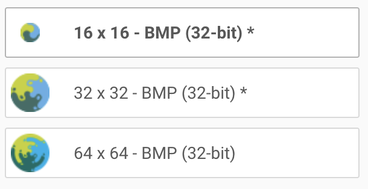

# CCP Favicon

The `favicon` folder contains **the six files that fit most needs** ([see here](https://evilmartians.com/chronicles/how-to-favicon-in-2021-six-files-that-fit-most-needs))

**Resources**

- https://evilmartians.com/chronicles/how-to-favicon-in-2021-six-files-that-fit-most-needs
- Ico Editor: https://redketchup.io/icon-editor

# Specifications

## HTML

```html
<link rel="icon" href="/favicon.ico" /><!-- 32×32 -->
<link rel="icon" href="/icon.svg" type="image/svg+xml" />
<link rel="apple-touch-icon" href="/apple-touch-icon.png" /><!-- 180×180 -->
<link rel="manifest" href="/app.webmanifest" />
```

## `favicon.ico`

Multiple sizes faviocn



## `icon.svg`

Minified CCP icon

## `apple-touch-icon.png`

> Apple touch icon is an image that Apple devices will use if you add the webpage as a shortcut to your home screen on an iPhone or iPad.

- Added 20px padding around the icon

## `app.webmanifest`

```json
{
  "name": "Comparative Cultural Psychology",
  "short_name": "CCP",
  "icons": [
    { "src": "/192.png", "type": "image/png", "sizes": "192x192" },
    { "src": "/512.png", "type": "image/png", "sizes": "512x512" }
  ]
}
```
